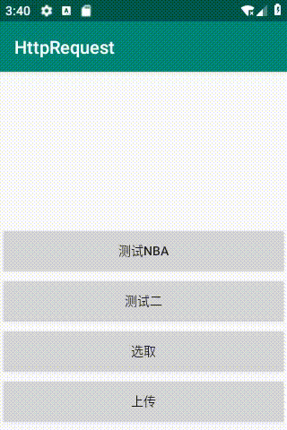

# HttpRequest

基于Retrofit2+RxJava+OkHttp3+RxLifecycle3的网络请求框架

#### 1、添加依赖和配置

* 工程添加依赖仓库，Add the JitPack repository to your build file

```Java
allprojects {
   repositories {
   		...
   	    maven { url 'https://jitpack.io' }
   }
}
```

```Java
compileOptions {
        sourceCompatibility JavaVersion.VERSION_1_8
        targetCompatibility JavaVersion.VERSION_1_8
    }
```

```Java
dependencies {

       implementation 'com.github.Mp5A5:HttpRequest:1.0.3'
}
```
如果项目是用的support包则使用RxLifecycle2及对应的版本
```Java
    implementation 'com.trello.rxlifecycle2:rxlifecycle:latest-version'
    implementation 'com.trello.rxlifecycle2:rxlifecycle-android:latest-version'
    implementation 'com.trello.rxlifecycle2:rxlifecycle-components:version'
```
如果项目是用的androidx包则使用RxLifecycle3及对应的版本
```Java
    implementation 'com.trello.rxlifecycle3:rxlifecycle:latest-version'
    implementation 'com.trello.rxlifecycle3:rxlifecycle-android:latest-version'
    implementation 'com.trello.rxlifecycle3:rxlifecycle-components:latest-version'
```
#### 2、简单使用步骤

###### 1.在Application类中进行初始化操作

```Java
@Override
    public void onCreate() {
        super.onCreate();

        String baseUrl = "http://op.juhe.cn/";
        ArrayMap<String, String> headMap = new ArrayMap<String, String>();
        headMap.put("key1", "value1");
        headMap.put("key2", "value2");
        headMap.put("key3", "value3");

        SslSocketConfigure sslSocketConfigure = new SslSocketConfigure.Builder()
                .setVerifyType(2)//单向双向验证 1单向  2 双向
                .setClientPriKey("client.bks")//客户端keystore名称
                .setTrustPubKey("truststore.bks")//受信任密钥库keystore名称
                .setClientBKSPassword("123456")//客户端密码
                .setTruststoreBKSPassword("123456")//受信任密钥库密码
                .setKeystoreType("BKS")//客户端密钥类型
                .setProtocolType("TLS")//协议类型
                .setCertificateType("X.509")//证书类型
                .build();


        ApiConfig build = new ApiConfig.Builder()
                .setBaseUrl(baseUrl)//BaseUrl，这个地方加入后项目中默认使用该url
                .setInvalidateToken(0)//Token失效码
                .setSucceedCode(200)//成功返回码
                .setFilter("com.mp5a5.quit.broadcastFilter")//失效广播Filter设置
                //.setDefaultTimeout(2000)//响应时间，可以不设置，默认为2000毫秒
                //.setHeads(headMap)//动态添加的header，也可以在其他地方通过ApiConfig.setHeads()设置
                //.setOpenHttps(true)//开启HTTPS验证
                //.setSslSocketConfigure(sslSocketConfigure)//HTTPS认证配置
                .build();
        /*
         *     Token失效后发送动态广播的Filter，配合BaseObserver中的标识进行接收使用
         *     public static final String TOKEN_INVALID_TAG = "token_invalid"; ------------>>>>>>>>>>对应name
         *     public static final String QUIT_APP = "quit_app"; ------------>>>>>>>>>>对应value
         *
         *
         *     oncreate()方法中初始化
         *     private void initReceiver() {
         *         mQuitAppReceiver = new QuitAppReceiver();
         *         IntentFilter filter = new IntentFilter();
         *         filter.addAction(ApiConfig.getQuitBroadcastReceiverFilter());
         *         registerReceiver(mQuitAppReceiver, filter);
         *     }
         *
         *
         *     private class QuitAppReceiver extends BroadcastReceiver {
         *
         *         @Override
         *         public void onReceive(Context context, Intent intent) {
         *             if (ApiConfig.getQuitBroadcastReceiverFilter().equals(intent.getAction())) {
         *
         *                 String msg = intent.getStringExtra(BaseObserver.TOKEN_INVALID_TAG);
         *                 if (!TextUtils.isEmpty(msg)) {
         *                     Toast.makeText(TestActivity.this, msg, Toast.LENGTH_SHORT).show();
         *                 }
         *             }
         *         }
         *     }
         *
         */

        build.init(this);
    }

```
###### 2.定义接口

```Java
public interface NBAApiT {

    @GET("onebox/basketball/nba")
    Observable<NBAEntity> getNBAInfo(@QueryMap ArrayMap<String, Object> map);
}
```

###### 3.创建实例
```Java
单例模式创建Service，推荐使用这种
public class NbaService {


    private NBAApiT nbaApiT;

    private NbaService() {
        nbaApiT = RetrofitFactory.getInstance().create(NBAApiT.class);
    }

    public static NbaService getInstance() {
        return NbaServiceHolder.S_INSTANCE;
    }

    private static class NbaServiceHolder {
        private static final NbaService S_INSTANCE = new NbaService();
    }


    public Observable<NBAEntity> getNBAInfo(String key) {
        ArrayMap<String, Object> arrayMap = new ArrayMap<String, Object>();
        arrayMap.put("key", key);
        return nbaApiT.getNBAInfo(arrayMap);
    }

}
```

```Java
使用new Service创建Service，这中用来做动态切换BaseUrl测试等
public class NBAServiceTT {

    private NBAApi mNbaApi;

    public NBAServiceTT() {
        //涉及到动态切换BaseUrl则用new Service()，不使用单例模式
        mNbaApi = RetrofitFactory.getInstance().create("http://op.juhe.cn/", NBAApi.class);
    }

    public Observable<NBAEntity> getNBAInfo(String key) {
        ArrayMap<String, Object> arrayMap = new ArrayMap<String, Object>();
        arrayMap.put("key", key);
        return mNbaApi.getNBAInfo(arrayMap);
    }
}
```

###### 4.设置接收参数
```Java
实体类必须继承BaseResponseEntity，如果公司返回的参数不叫code，则使用@SerializedName("value")起别名的方式，写个别名
public class NBAEntity extends BaseResponseEntity {


    @SerializedName("error_code")
    public int code;
    public String reason;
    public ResultBean result;


    public static class ResultBean {


        public String title;
        public StatuslistBean statuslist;
        public List<ListBean> list;
        public List<TeammatchBean> teammatch;

        、、、
}

```
###### 5.发送请求,接收参数

```Java

findViewById(R.id.btnNBA).setOnClickListener(v -> {
            NbaService.getInstance()
                    .getNBAInfo("6949e822e6844ae6453fca0cf83379d3")
                    .subscribeOn(Schedulers.io())
                    .observeOn(AndroidSchedulers.mainThread())
                    .compose(this.bindToLifecycle())
                    .subscribe(new BaseObserver<NBAEntity>(){

                        @Override
                        public void onSuccess(NBAEntity response) {
                            Toast.makeText(TestNBAActivity.this, response.result.title, Toast.LENGTH_SHORT).show();
                        }

                    });


        });

```

#### 3、效果展示



###### 6.参考资料请移交 https://blog.csdn.net/CherryBean/article/details/86223249

